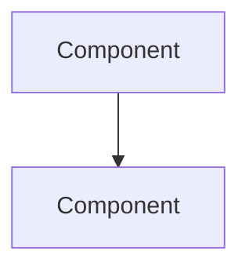

# {Architecture Document Title}

## Overview

<!-- High-level description -->

## Diagram

<!-- Mermaid or ASCII diagram -->

## Key Concepts

<!-- Important concepts to understand -->

## Components

| Component | Purpose | Location |
| --------- | ------- | -------- |
| ...       | ...     | ...      |

## Data Flow

<!-- How data moves through the system -->

## Related Documents

- [ADR Index](./adr/_index.md) - Architectural decisions
- [Component: X](./components/x.md) - Component details
