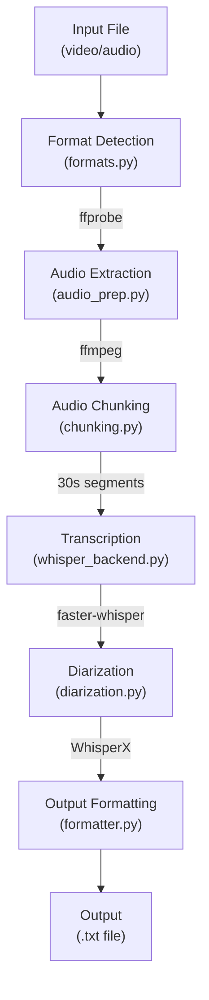

# System Architecture

## Overview

Scribbulus is a production-grade CLI tool for transcribing audio and video
files. It uses a pipeline architecture that processes media files through
discrete stages: format detection, audio extraction, chunking, transcription,
and optional speaker diarization.

## Component Diagram

## Key Components

| Component     | Purpose                               | Location                       |
| ------------- | ------------------------------------- | ------------------------------ |
| CLI           | User interface and argument parsing   | `src/scribbulus/cli/`          |
| Media         | Format detection and audio extraction | `src/scribbulus/media/`        |
| Transcription | Whisper backend, chunking, diarization| `src/scribbulus/transcription/`|
| Utils         | Errors, types, formatting             | `src/scribbulus/utils/`        |

## Data Flow

1. **Input**: User provides audio/video file path
2. **Detection**: `formats.py` identifies file type using ffprobe
3. **Extraction**: `audio_prep.py` extracts audio to WAV using ffmpeg
4. **Chunking**: `chunking.py` splits audio into 30-second overlapping segments
5. **Transcription**: `whisper_backend.py` processes chunks with faster-whisper
6. **Diarization** (optional): `diarization.py` identifies speakers with WhisperX
7. **Formatting**: `formatter.py` wraps text and formats output
8. **Output**: Formatted transcript written to stdout or file

## External Dependencies

| Dependency     | Purpose                       | Required |
| -------------- | ----------------------------- | -------- |
| FFmpeg         | Audio extraction from video   | Yes      |
| faster-whisper | Speech-to-text transcription  | Yes      |
| WhisperX       | Speaker diarization           | Optional |
| CUDA           | GPU acceleration              | Optional |

## Memory Architecture

Scribbulus is designed for memory efficiency:

- Audio is processed in 30-second chunks (not loaded entirely into RAM)
- Temporary files are cleaned up immediately after processing
- Whisper model is loaded once and reused for all chunks
- Diarization model runs after transcription, not concurrently

Typical memory usage:

| Configuration           | VRAM  | RAM   |
| ----------------------- | ----- | ----- |
| CPU, no diarization     | -     | ~4GB  |
| GPU, no diarization     | ~6GB  | ~2GB  |
| GPU, with diarization   | ~8GB  | ~2GB  |

## Related Documents

- [ADR Index](./adr/_index.md) - All architectural decisions
- [Component: Transcription Engine](./components/transcription-engine.md)
- [Component: Media Processor](./components/media-processor.md)
