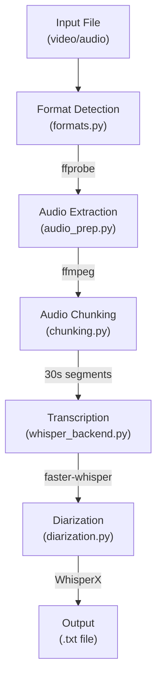

# Transcription Tool - Design Plan

## Overview

Scribbulus is a production-grade CLI tool for transcribing audio and video files to text
using faster-whisper with speaker diarization support.

## Requirements

### Functional Requirements

1. Accept any common audio file (WAV, MP3, M4A, FLAC, OGG, AAC)
2. Accept any common video file (MP4, MOV, MKV, AVI, WebM)
3. Extract audio from video using FFmpeg
4. Transcribe audio using faster-whisper
5. Identify speakers using WhisperX/pyannote (optional)
6. Output plain text transcript with speaker labels
7. Support language auto-detection or manual specification
8. Handle large files without loading entirely into RAM

### Non-Functional Requirements

1. Cross-platform: macOS and Linux
2. Memory-efficient: chunked processing for large files
3. Production-grade error handling
4. Clear progress reporting
5. Secure: no shell injection, safe file handling

## Non-Goals

1. Real-time/streaming transcription
2. GUI interface
3. Cloud API integration (local-only)
4. Video output or subtitle burning
5. Audio editing or enhancement
6. Windows support (best-effort only)

## Design Decisions

| Decision           | Choice              | Rationale                         |
| ------------------ | ------------------- | --------------------------------- |
| CLI Framework      | Click               | Industry standard, excellent docs |
| STT Engine         | faster-whisper      | Free, fast, accurate, local       |
| Whisper Model      | large-v3-turbo      | Best speed/accuracy balance       |
| Diarization        | WhisperX + pyannote | Best speaker identification       |
| Package Manager    | uv                  | Fast, modern Python tooling       |
| FFmpeg Integration | subprocess (list)   | Security, no shell=True           |

## Architecture



## CLI Interface

```bash
scribbulus transcribe INPUT_FILE [OPTIONS]

Options:
  -o, --output PATH      Output file path (default: input_name.txt)
  -l, --language CODE    Language code (auto-detect if not set)
  --model MODEL          Whisper model size (default: large-v3-turbo)
  --no-diarization       Disable speaker identification
  --num-speakers N       Number of speakers (auto if not set)
  --hf-token TOKEN       HuggingFace token (or HF_TOKEN env var)
  -v, --verbose          Verbose output
  --help                 Show help message
```

## Exit Codes

| Code | Meaning              |
| ---- | -------------------- |
| 0    | Success              |
| 1    | General error        |
| 2    | Input file not found |
| 3    | Unsupported format   |
| 4    | No audio stream      |
| 5    | FFmpeg not found     |
| 6    | Transcription failed |
| 7    | Diarization failed   |

## Security Considerations

1. Never use `shell=True` in subprocess calls
2. Validate and sanitize file paths
3. Create temp files in system temp directory
4. HuggingFace token read from environment, never logged
5. No user data sent to external services

## Dependencies

### Python Packages

- click>=8.1
- faster-whisper>=1.0
- whisperx>=3.0
- torch>=2.0
- torchaudio>=2.0
- pydub>=0.25
- tqdm>=4.60

### System Dependencies

- FFmpeg (for audio extraction)
- CUDA (optional, for GPU acceleration)

## References

- [faster-whisper Documentation](https://github.com/SYSTRAN/faster-whisper)
- [WhisperX GitHub](https://github.com/m-bain/whisperX)
- [FFmpeg Documentation](https://ffmpeg.org/documentation.html)
